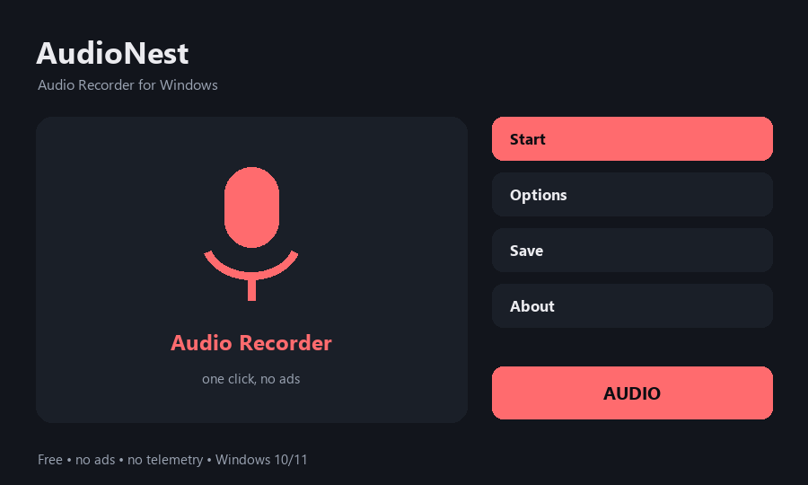

# AudioNest — Audio Recorder for Windows

Free microphone audio recorder for Windows - clean WAV, no limit

**[⬇ Download for Windows](../../releases/latest)** — free, no ads, no account, no sign-up. One small file, unzip and run.

## What it does

- Record your microphone with a single button
- Saves a clean WAV file to Music\AudioNest
- No time limit and no watermark
- Uses the built-in Windows audio engine, no heavy drivers
- Light and fast, works on low-end PCs
- Free and open source, no ads and no telemetry

## How to use

1. Open AudioNest.
2. Press Record - the timer starts and your microphone is captured.
3. Press Stop - a clean WAV file is saved to Music\AudioNest.
4. Press Open Folder to find your recordings.

## Requirements

Windows 10 or 11, 64-bit. No admin rights needed and nothing is written to the registry. It runs fine on weak, old and budget machines.

## Privacy

Everything happens on your PC. Nothing is uploaded, there is no telemetry, no ads and no account.

## Licence

MIT — free to use, free to share.
