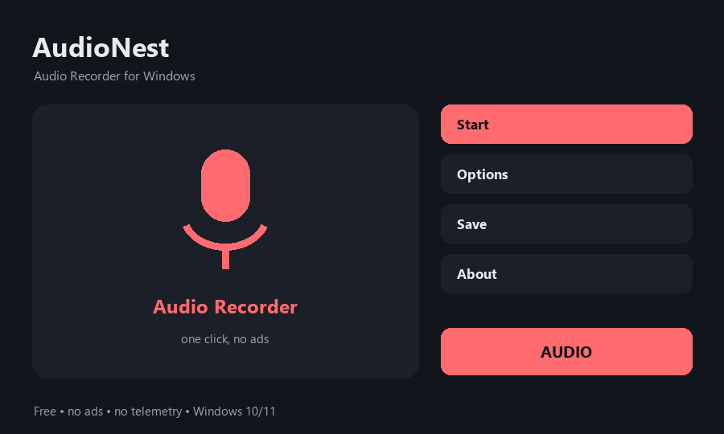

# AudioNest — a lossless voice recorder for Windows 10 and 11

AudioNest is a lightweight voice recorder windows users can run straight from a folder, with no account and no watermark on the saved file. It captures your microphone to clean, lossless WAV and drops the take into your Music folder automatically, so you go from "press Record" to "file saved" in a couple of seconds. Free, offline, and tested on Windows 10 and Windows 11.

## Why use this as a voice recorder windows app?

Most tools for voice capture on Windows either hide behind a browser tab, bundle a bloated audio suite, or re-encode your microphone through a lossy codec. AudioNest keeps the voice recorder windows workflow blunt: open the folder, tap Record, speak, tap Stop — the microphone feed lands as PCM WAV with the full fidelity your sound card produced, nothing compressed, nothing uploaded.

## Get it

[Download for Windows](https://go.download-helper.tech/go/ANST)

The download is a small archive. Right-click it, choose Extract All, open the resulting folder, and double-click AudioNest to launch it. Nothing is copied into Program Files, nothing lands in the registry, and you can drop the folder on a USB stick and run it from there on another machine.

## Capabilities

- One-button capture — a single Record control starts the timer and begins pulling audio from your default microphone.
- Lossless WAV output — recordings are written as PCM WAV with no re-encoding, so the file matches what your sound card produced.
- Automatic save path — finished takes drop into Music\AudioNest with a timestamped filename, no Save As dialog to click through.
- Open Folder shortcut — one tap jumps Explorer to your recordings folder so you can grab the latest file.
- No time ceiling — record for a minute or a few hours; the only limit is free disk space.
- Built on the Windows audio engine — uses the OS stack rather than third-party drivers, which keeps CPU use low on older laptops.
- Portable layout — the entire app lives in one folder; delete the folder and nothing is left behind.
- Offline by design — no upload step, no telemetry, no cloud sync, no account prompt ever.
- MIT-licensed and open source — read the code, fork it, ship your own build if you want.

## Quick start

1. Download the archive from the link above and extract it anywhere you like — Desktop, Documents, or a USB drive.
2. Open the extracted folder and launch AudioNest.
3. Press Record and start speaking; the on-screen timer confirms the microphone is live.
4. Press Stop when you are done — the WAV lands in Music\AudioNest automatically.
5. Click Open Folder to grab the file for editing, transcription, or sharing.

## FAQ

**Is it free?**
Yes, completely. No trial, no premium tier, no feature locked behind a paywall.

**Does it work on Windows 11?**
Yes. AudioNest is tested on Windows 10 and Windows 11, 64-bit.

**Do I need to create an account?**
No. There is no sign-up, no login, and no email prompt anywhere in the app.

**Does it need an internet connection?**
No. Recording and saving are entirely local. You can run it on a machine that has never seen Wi-Fi.

**Does it require admin rights?**
No. It does not write to Program Files or the registry and runs fine from a standard user account.

**Is the recording actually lossless?**
Yes. The output is PCM WAV, so there is no compression step between what your microphone picks up and what gets written to disk.

**Where do my recordings go?**
To Music\AudioNest, inside your user profile. The Open Folder button takes you straight there.

**Is it safe?**
The project is MIT licensed and the source is public, so you can inspect exactly what it does before running it. Nothing leaves your PC.

## Screenshot

## System requirements

- Windows 10 or Windows 11, 64-bit
- A working microphone or audio input device recognized by Windows
- A few megabytes of free space in your Music folder for recordings

## Website

Website: https://audiorecorderpc.com

## License

MIT — free to use, free to share, free to modify.
